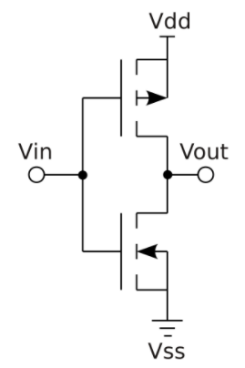
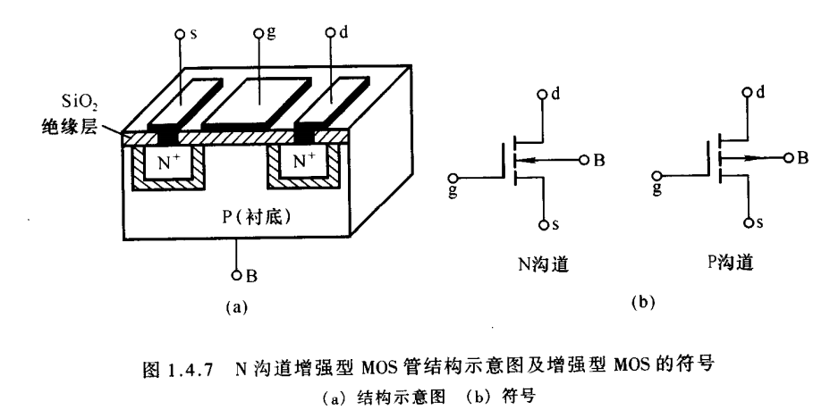

## CMOS:

​		CMOS是Complementary Metal Oxide Semiconductor（互补金属氧化物半导体）的缩写。它是指制造大规模[集成电路芯片](https://baike.baidu.com/item/集成电路芯片/4872662?fromModule=lemma_inlink)用的一种技术或用这种技术制造出来的芯片，是电脑主板上的一块可读写的RAM芯片。因为可读写的特性，所以在[电脑主板](https://baike.baidu.com/item/电脑主板/10662395?fromModule=lemma_inlink)上用来保存BIOS设置完[电脑硬件](https://baike.baidu.com/item/电脑硬件/165440?fromModule=lemma_inlink)参数后的数据，这个芯片仅仅是用来存放数据的

​		在CMOS电路中，以及集成电路中，[MOS管](https://so.csdn.net/so/search?q=MOS管&spm=1001.2101.3001.7020)都是很重要的元件，是构成电路的基本元件。

​		而CMOS电路中的基本单元是MOS对管，就是使用P沟道和N沟道MOS对接的一种电路。具体电路如下（这也是CMOS反相器的电路）

## MOS管

- **g：栅极
  d：漏极
  s：源极**

上图是**N沟道增强型MOS管**，工作原理如下：
1、当栅极和源极两端不加电压，Vgs = 0，漏极和源极之间只是两只背向的PN结，不存在导电沟道，因此即使漏极和源极两端之间加电压，Vds != 0，也不会有漏极电流。
2、当Vds = 0，且Vgs > 0时，由于绝缘层存在，栅极电流为0。但是栅极金属层将聚集正电荷，他们排斥P型衬底靠近绝缘层一侧的空穴，使之剩下的不能移动的负离子区，形成耗尽层，如下图：

当Vgs增大时，一方面耗尽层增宽，另一方面将衬底的自由电子吸引到耗尽层和绝缘层之间，形成一个N型薄层（反型层），这个反型层就构成了漏极和源极之间的导电沟道。
**使沟道刚刚形成的Vgs为开启电压，Vgs越大，反型层越大，导电沟道电阻越小。**

### 1、CMOS反相器（非门）

其中T1为P沟道增强型MOS管，其中T2为N沟道增强型MOS管

### 2、CMOS与非/或非门

### 3、漏极开路输出门电路（OD门）

OD门输出电路是一个漏极开路的N沟道增强型MOS管TN
OD门符号中，菱形下方的横线表示输出低电平时为低输出电阻
**OD门工作时，必须将输出端经上拉电阻接到电源上**，而**两个OD门可以构成线与电路**

### 4、CMOS传输门

CMOS传输门用于将电压取倒数

### 5、CMOS异或门

### 6、CMOS三态输出门电路（输出缓冲器）

其中，逻辑符号中 ，EN’连接的○代表低电平有效
EN = 0时，Y = A’;
EN = 1时，Y = Z（高阻态）（X代表不定态）