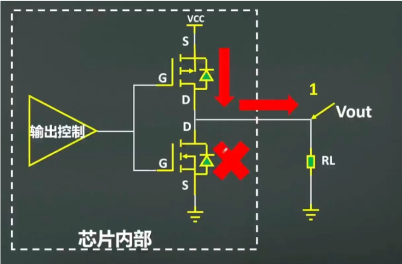
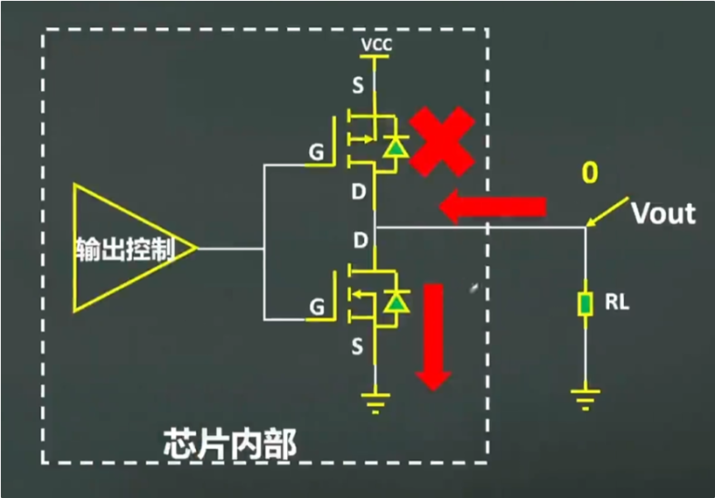
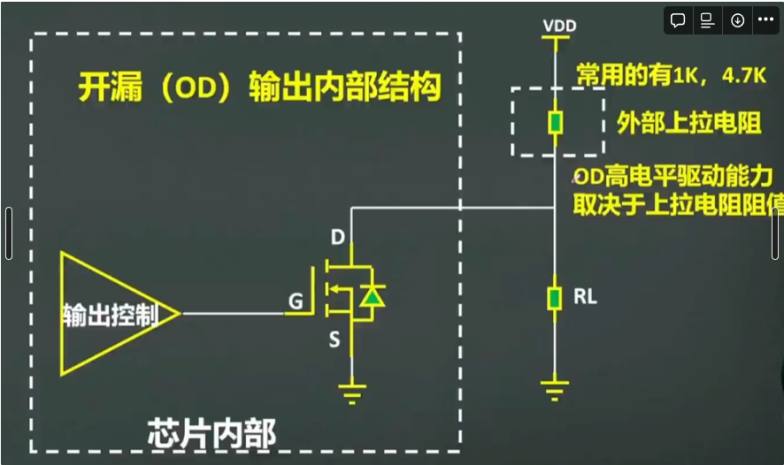
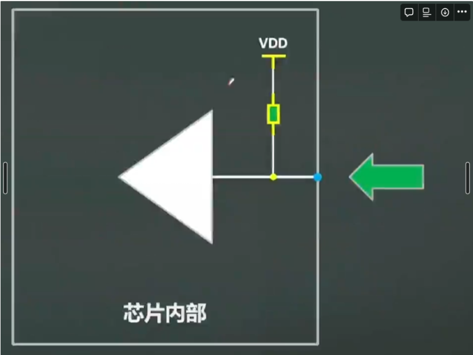
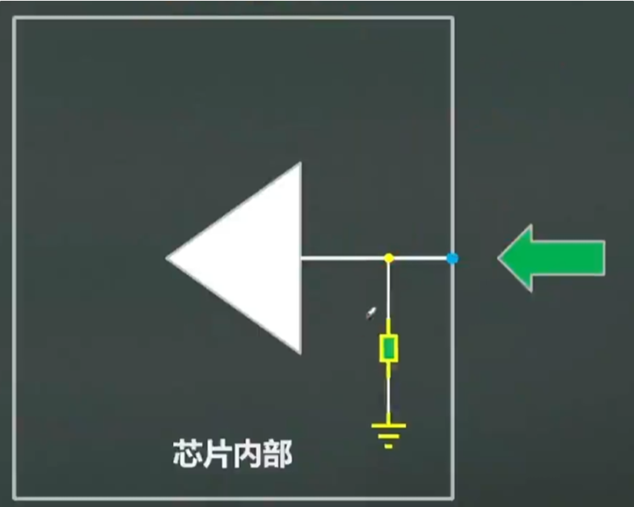
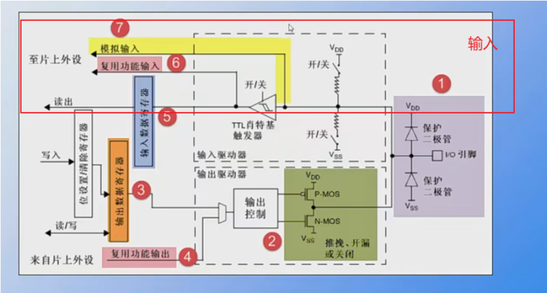

## GPIO

​	 **GPIO是指通用输入输出（General Purpose Input/Output），是一种通用的数字输入输出接口，可以通过程序控制来读取或控制外部设备。**

​	在单片机或嵌入式系统中，GPIO通常由一个或多个引脚组成，可以通过编程来配置引脚的工作模式（输入或输出）、电平状态（高电平或低电平）等参数，即，

- 数字芯片的IO口，一般分为输入和输出
- 数字芯片内部单元大都是CMOS，一般mos的栅极为输入，漏极为输出

## 基本类型

输出：

- 开漏输出（op）
- 推挽输出（pp）
- 复用开漏
- 复用推挽

输出：

- 浮空输入
- 下拉输入
- 上拉输入

## 输出

### 推挽输出

推挽输出是指`输出端口通过一个晶体管的开关来控制电平状态，推挽输出可以实现高电平和低电平两种状态`

输出高电平时，NPN型晶体管导通，PNP型晶体管截止，呈现向外推的形式，为`推`

输出低电平时，PNP型晶体管导通，NPN型晶体管截止，呈现向回挽的形式，为`挽`

优点：

1. 输出高低电平、电源电压基本没有压差
2. 高低电平驱动能力较强，一般数字芯片推挽，输出IO口驱动电流最大可到20ma
3. 电平切换速度快

缺点： 不支持线与（指俩个输出不可以接到一起）

### 开漏输出

输出端口通过一个晶体管的开关来控制电平状态，但与推挽输出不同，**开漏输出只能实现低电平状态，而不能直接输出高电平**。

*开漏输出的原理是，在输出端口接入一个NPN型晶体管，它的集电极连接到输出端口，发射极接地。**当需要输出低电平时，晶体管导通，输出端口接地，形成低电平；当需要输出高电平时，晶体管截止，输出端口处于悬空状态，即高阻态**。为了实现完整的输出功能，开漏输出通常需要结合外部上拉电阻。当输出端口处于高阻态时，外部上拉电阻将输出端口拉高至所需的高电平。因此，开漏输出可以通过控制晶体管的导通和截止来实现低电平输出，而高电平输出则由外部上拉电阻提供。开漏输出常用于多路设备共享总线的情况下，如I2C、SPI等通信协议中。通过多个开漏输出端口的组合，可以实现多路设备对总线的控制，同时避免输出冲突和电平干扰。*

优点：

1. 可实现电平转换，输出电平取决于上拉电阻电源
2. 可以实现IO的线与

缺点：

1. 高电平的驱动能力差，取决于外部上拉电阻
2. 电平切换速率取决于外部上拉电阻

### 高阻态

关于开漏输出的高阻态，他通常用在总线上，当主设备与其中一个从设备相连的时候，阻断其他设备与主设备相连，即呈现出高阻态的形式。

##  输入

### 上拉输入

是指芯片输入引脚通过电阻接到电源电压

### 下拉输入

指芯片输入引脚通过电阻借到参考0电平 

### 浮空输入

浮空输入是指将输入引脚未连接到任何外部信号源或电路，使其处于未定义的状态。在这种情况下，输入引脚既不连接到高电平（VDD）也不连接到低电平（GND），而是处于开路状态。

浮空输入可能会导致输入信号漂移或产生不确定的结果。这是因为未连接的输入引脚可以受到周围环境中的电磁干扰，从而引起电压波动，进而影响输入状态。在某些情况下，浮空输入可能会被误认为是高电平或低电平，这取决于具体的电路设计和输入引脚的特性。

### STM32 GPIO电路设计

我们主要看一下他这个推挽、开漏输出的设计，N-MOS晶体管导通，P-MOS晶体管截止，呈现向外推的形式，为`推`，P-MOS管截止，N-MOS导通，为挽。 当为开漏状态时，只需要N-MOS管，当需要输出低电平时，晶体管导通，输出端口接地，形成低电平；当需要输出高电平时，晶体管截止，输出端口处于悬空状态，即高阻态。